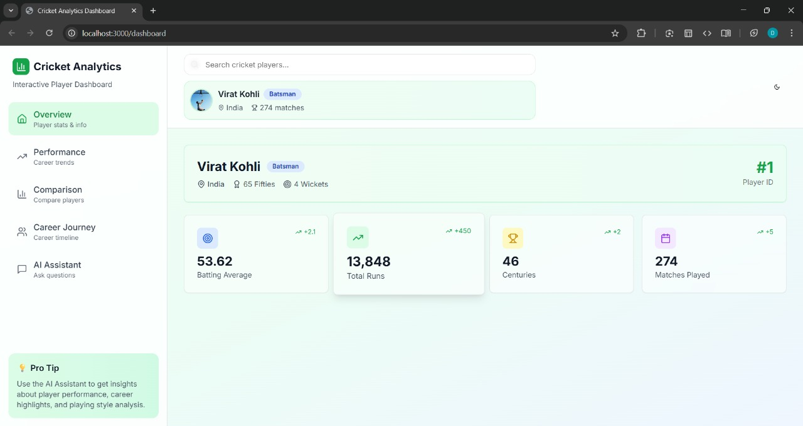
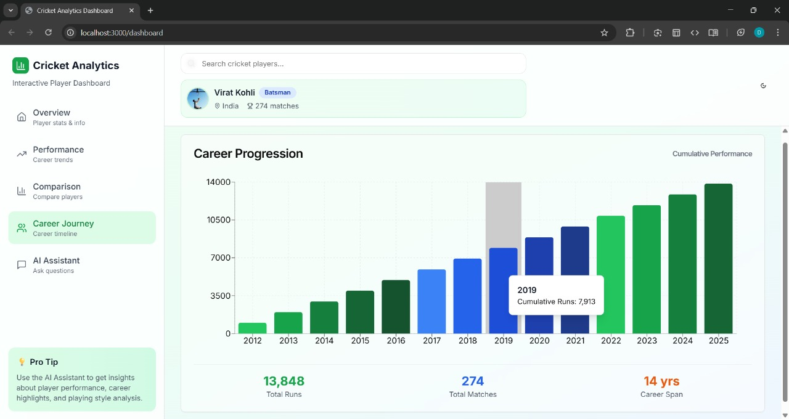
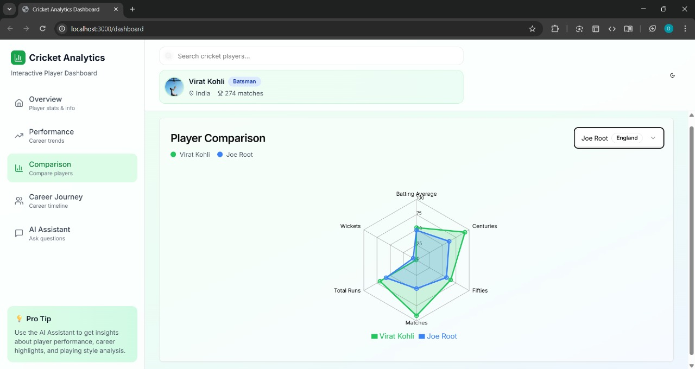
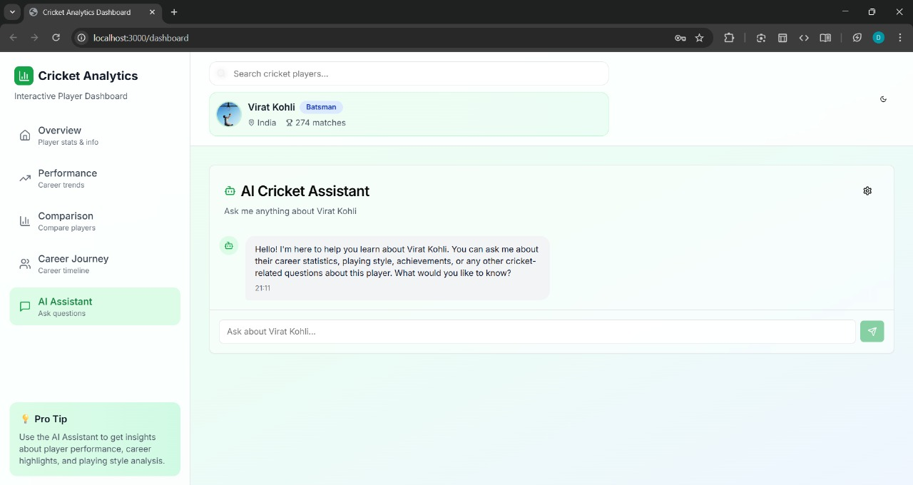
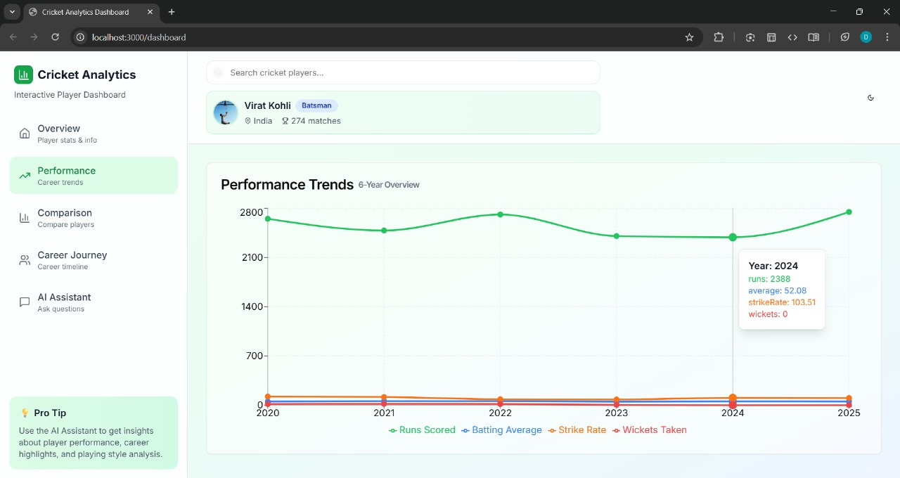

## 🛠️ Installation & Setup

```bash
# Clone the repository
git clone https://github.com/DakshNathani/TASK-1.git

# Install dependencies
npm install

# Start development server
npm run dev
```

## Dashboard

## Progression chart

## Comparision chart

## Gemmini chatbot

## Dark Mode

## Performance Chart
